<body class="c12 doc-content">
  
Track DevSecOps

  

  

  
&#1048;&#1089;&#1093;&#1086;&#1076;&#1085;&#1099;&#1077; &#1076;&#1072;&#1085;&#1085;&#1099;&#1077;

  

  <ul class="c8 lst-kix_y5v782a1wf4m-0 start">
    <li class="c1 li-bullet-0">&#1057;&#1077;&#1088;&#1074;&#1077;&#1088; &#1089; &#1087;&#1091;&#1073;&#1083;&#1080;&#1095;&#1085;&#1099;&#1084; &#1072;&#1076;&#1088;&#1077;&#1089;&#1086;&#1084; 176.113.83.63</li>
    <li class="c1 li-bullet-0">&#1050;&#1086;&#1084;&#1087;&#1100;&#1102;&#1090;&#1077;&#1088; &#1088;&#1072;&#1079;&#1088;&#1072;&#1073;&#1086;&#1090;&#1095;&#1080;&#1082;&#1072; &#1089; &#1072;&#1082;&#1090;&#1080;&#1074;&#1085;&#1086;&#1081; &#1089;&#1080;&#1089;&#1090;&#1077;&#1084;&#1086;&#1081; git</li>
    <li class="c1 li-bullet-0">Gitlab CI</li>
    <li class="c1 li-bullet-0">&#1055;&#1088;&#1080;&#1083;&#1086;&#1078;&#1077;&#1085;&#1080;&#1077; &#1085;&#1072; &#1095;&#1080;&#1089;&#1090;&#1086;&#1084; php &#1089; &#1080;&#1089;&#1087;&#1086;&#1083;&#1100;&#1079;&#1086;&#1074;&#1072;&#1085;&#1080;&#1077;&#1084; &#1073;&#1072;&#1079;&#1099; &#1076;&#1072;&#1085;&#1085;&#1099;&#1093; mariadb &#1080; &#1082;&#1101;&#1096;&#1072;.</li>
  </ul>
  

  
&#1050;&#1086;&#1088;&#1086;&#1090;&#1082;&#1086; &#1086; &#1087;&#1088;&#1086;&#1077;&#1082;&#1090;&#1077;

  

  
&#1057;&#1072;&#1081;&#1090; &#1087;&#1088;&#1077;&#1076;&#1089;&#1090;&#1072;&#1074;&#1083;&#1103;&#1077;&#1090; &#1089;&#1086;&#1073;&#1086;&#1081; &#1085;&#1072;&#1095;&#1072;&#1083;&#1100;&#1085;&#1091;&#1102; &#1092;&#1086;&#1088;&#1084;&#1091; &#1089;&#1086;&#1094;&#1080;&#1072;&#1083;&#1100;&#1085;&#1086;&#1081; &#1089;&#1077;&#1090;&#1080; &#1089; &#1088;&#1077;&#1075;&#1080;&#1089;&#1090;&#1088;&#1072;&#1094;&#1080;&#1077;&#1081; &#1087;&#1086;&#1083;&#1100;&#1079;&#1086;&#1074;&#1072;&#1090;&#1077;&#1083;&#1077;&#1081; &#1080; &#1074;&#1086;&#1079;&#1084;&#1086;&#1078;&#1085;&#1086;&#1089;&#1090;&#1100;&#1102; &#1076;&#1077;&#1083;&#1080;&#1090;&#1100;&#1089;&#1103; &#1089;&#1074;&#1086;&#1080;&#1084; &#1084;&#1085;&#1077;&#1085;&#1080;&#1077;&#1084; &#1089; &#1076;&#1088;&#1091;&#1075;&#1080;&#1084;&#1080; &#1102;&#1079;&#1077;&#1088;&#1072;&#1084;&#1080;.

  
&#1042; &#1073;&#1091;&#1076;&#1091;&#1097;&#1077;&#1084; &#1073;&#1091;&#1076;&#1091;&#1090; &#1088;&#1077;&#1072;&#1083;&#1080;&#1079;&#1086;&#1074;&#1072;&#1085;&#1099; &#1086;&#1089;&#1085;&#1086;&#1074;&#1085;&#1099;&#1077; &#1092;&#1091;&#1085;&#1082;&#1094;&#1080;&#1080; &#1086;&#1073;&#1077;&#1089;&#1087;&#1077;&#1095;&#1080;&#1074;&#1072;&#1102;&#1097;&#1080;&#1077; &#1082;&#1086;&#1085;&#1092;&#1080;&#1076;&#1077;&#1085;&#1094;&#1080;&#1072;&#1083;&#1100;&#1085;&#1086;&#1089;&#1090;&#1100; &#1080; &#1087;&#1088;&#1080;&#1074;&#1072;&#1090;&#1085;&#1086;&#1089;&#1090;&#1100; &#1102;&#1079;&#1077;&#1088;&#1086;&#1074;, &#1083;&#1080;&#1095;&#1085;&#1099;&#1077; &#1089;&#1086;&#1086;&#1073;&#1097;&#1077;&#1085;&#1080;&#1103;, &#1074;&#1086;&#1079;&#1084;&#1086;&#1078;&#1085;&#1086;&#1089;&#1090;&#1100; &#1088;&#1072;&#1079;&#1084;&#1077;&#1097;&#1072;&#1090;&#1100; &#1087;&#1088;&#1080;&#1074;&#1072;&#1090;&#1085;&#1099;&#1081; &#1082;&#1086;&#1085;&#1090;&#1077;&#1085;&#1090; &#1080; &#1087;&#1086;&#1083;&#1091;&#1095;&#1072;&#1090;&#1100; &#1079;&#1072; &#1101;&#1090;&#1086; &#1076;&#1086;&#1085;&#1072;&#1090;&#1099; &#1089; &#1087;&#1086;&#1084;&#1086;&#1097;&#1100;&#1102; &#1089;&#1090;&#1086;&#1088;&#1086;&#1085;&#1085;&#1080;&#1093; api.

  

  
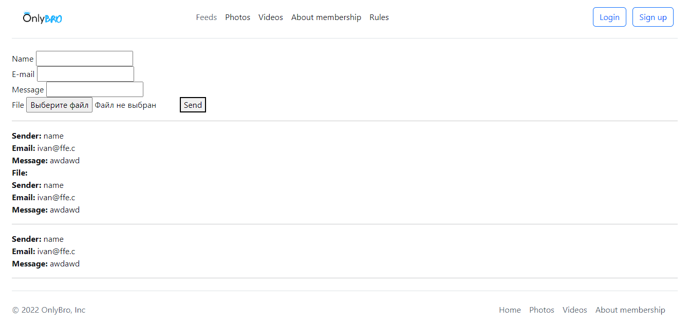

  

  

  
&#1069;&#1090;&#1072;&#1087;&#1099; &#1088;&#1072;&#1073;&#1086;&#1090;&#1099;

  

  
&nbsp;&#1069;&#1090;&#1072;&#1087; 1. CI/CD

  

  <ul class="c8 lst-kix_343oemqdpvx1-0 start">
    <li class="c1 li-bullet-0">&#1053;&#1072; &#1080;&#1089;&#1093;&#1086;&#1076;&#1085;&#1099;&#1081; &#1089;&#1077;&#1088;&#1074;&#1077;&#1088; &#1091;&#1089;&#1090;&#1072;&#1085;&#1086;&#1074;&#1083;&#1077;&#1085;&#1072; &#1086;&#1087;&#1077;&#1088;&#1072;&#1094;&#1080;&#1086;&#1085;&#1085;&#1072;&#1103; &#1089;&#1080;&#1089;&#1090;&#1077;&#1084;&#1072; Debian 11.</li>
    <li class="c1 li-bullet-0">&#1044;&#1083;&#1103; &#1087;&#1088;&#1086;&#1094;&#1077;&#1089;&#1089;&#1072; CI &#1084;&#1085;&#1086;&#1081; &#1073;&#1099;&#1083; &#1074;&#1099;&#1073;&#1088;&#1072;&#1085; Gilab, &#1076;&#1083;&#1103; &#1088;&#1072;&#1073;&#1086;&#1090;&#1099; &#1082;&#1086;&#1090;&#1086;&#1088;&#1086;&#1075;&#1086; &#1085;&#1077;&#1086;&#1073;&#1093;&#1086;&#1076;&#1080;&#1084;&#1086; &#1091;&#1089;&#1090;&#1072;&#1085;&#1086;&#1074;&#1080;&#1090;&#1100; &#1080; &#1085;&#1072;&#1089;&#1090;&#1088;&#1086;&#1080;&#1090;&#1100; gitlab-runner &#1085;&#1072; &#1084;&#1072;&#1096;&#1080;&#1085;&#1077; &nbsp;176.113.83.63.</li>
    <li class="c1 li-bullet-0">&#1055;&#1077;&#1088;&#1077;&#1076; &#1086;&#1089;&#1085;&#1086;&#1074;&#1085;&#1086;&#1081; &#1088;&#1072;&#1073;&#1086;&#1090;&#1086;&#1081; &#1085;&#1077;&#1086;&#1073;&#1093;&#1086;&#1076;&#1080;&#1084;&#1086; &#1076;&#1086;&#1073;&#1072;&#1074;&#1080;&#1090;&#1100; IP &#1072;&#1076;&#1088;&#1077;&#1089;&#1089; gitlab.com &#1074; &#1092;&#1072;&#1081;&#1083; hosts &#1085;&#1072; &#1074;&#1089;&#1077;&#1093; &#1091;&#1089;&#1090;&#1088;&#1086;&#1081;&#1089;&#1090;&#1074;&#1072;&#1093;(&#1080;&#1089;&#1087;&#1086;&#1083;&#1100;&#1079;&#1091;&#1077;&#1090;&#1089;&#1103; &#1090;&#1086;&#1083;&#1100;&#1082;&#1086; &#1074; linux-&#1089;&#1080;&#1089;&#1090;&#1077;&#1084;&#1072;&#1093;).</li>
  </ul>
  

  
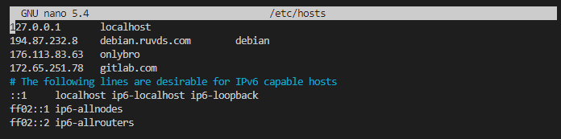

  

  <ul class="c8 lst-kix_343oemqdpvx1-0">
    <li class="c1 li-bullet-0">&#1042; &#1087;&#1077;&#1088;&#1074;&#1091;&#1102; &#1086;&#1095;&#1077;&#1088;&#1077;&#1076;&#1100; &#1079;&#1072;&#1093;&#1086;&#1076;&#1080;&#1084; &#1089; &#1082;&#1086;&#1084;&#1087;&#1100;&#1102;&#1090;&#1077;&#1088;&#1072; &#1088;&#1072;&#1079;&#1088;&#1072;&#1073;&#1086;&#1090;&#1095;&#1080;&#1082;&#1072; &#1074; &#1076;&#1080;&#1088;&#1077;&#1082;&#1090;&#1086;&#1088;&#1080;&#1102; &#1089; &#1087;&#1088;&#1086;&#1077;&#1082;&#1090;&#1086;&#1084; &#1080; &#1080;&#1085;&#1080;&#1094;&#1080;&#1072;&#1083;&#1080;&#1079;&#1080;&#1088;&#1091;&#1077;&#1084; git &#1082;&#1086;&#1084;&#1072;&#1085;&#1076;&#1086;&#1081; &ldquo;git init&rdquo;, &#1076;&#1072;&#1083;&#1077;&#1077; &#1088;&#1077;&#1075;&#1080;&#1089;&#1090;&#1088;&#1080;&#1088;&#1091;&#1077;&#1084;&#1089;&#1103; &#1082;&#1086;&#1084;&#1072;&#1085;&#1076;&#1072;&#1084;&#1080; &ldquo;git config --global user.name &ldquo;name example&rdquo;, &ldquo;git config --global user.email &ldquo;example@example&rdquo;. </li>
    <li class="c1 li-bullet-0">&#1044;&#1072;&#1083;&#1077;&#1077; &#1089;&#1086;&#1079;&#1076;&#1072;&#1077;&#1084; &#1087;&#1091;&#1073;&#1083;&#1080;&#1095;&#1085;&#1099;&#1081; &#1080; &#1087;&#1088;&#1080;&#1074;&#1072;&#1090;&#1085;&#1099;&#1081; &#1082;&#1083;&#1102;&#1095; &#1082;&#1086;&#1084;&#1072;&#1085;&#1076;&#1086;&#1081; ssh-keygen, &#1087;&#1077;&#1088;&#1077;&#1093;&#1086;&#1076;&#1080;&#1084; &#1082; &#1082;&#1083;&#1102;&#1095;&#1091; &#1080; &#1082;&#1086;&#1087;&#1080;&#1088;&#1091;&#1077;&#1084; &#1077;&#1075;&#1086; &#1074; &#1072;&#1082;&#1082;&#1072;&#1091;&#1085;&#1090; gitlab</li>
  </ul>
  

  
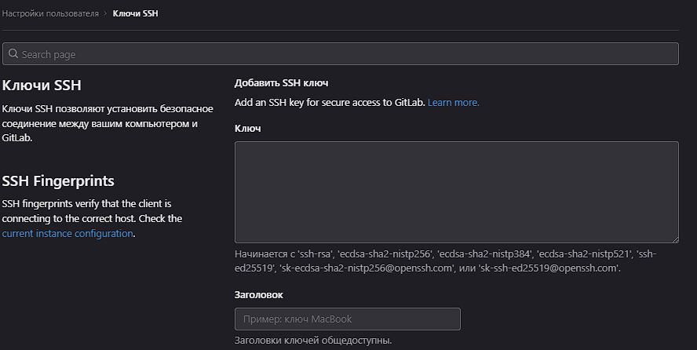

  
&nbsp; 

  

  

  

  <ul class="c8 lst-kix_343oemqdpvx1-0">
    <li class="c1 li-bullet-0">&#1047;&#1072;&#1090;&#1077;&#1084; &#1082;&#1083;&#1086;&#1085;&#1080;&#1088;&#1091;&#1077;&#1084; &#1088;&#1077;&#1087;&#1086;&#1079;&#1080;&#1090;&#1086;&#1088;&#1080;&#1081; &#1089; gitlab &#1082;&#1086;&#1084;&#1072;&#1085;&#1076;&#1072;&#1084;&#1080; &ldquo;git remote add origin -source&rdquo;, &ldquo;git pull --set-upstream origin main&rdquo;, &ldquo;git branch -M main&rdquo;, &ldquo;git pull&rdquo;.</li>
  </ul>
  

  
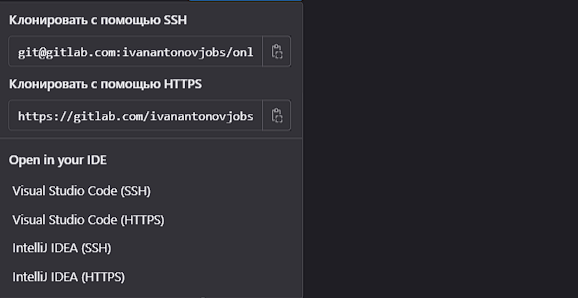

  

  <ul class="c8 lst-kix_343oemqdpvx1-0">
    <li class="c1 li-bullet-0">&#1057;&#1083;&#1077;&#1076;&#1091;&#1102;&#1097;&#1080;&#1084; &#1096;&#1072;&#1075;&#1086;&#1084; &#1091;&#1089;&#1090;&#1072;&#1085;&#1086;&#1074;&#1082;&#1072; &#1080; &#1085;&#1072;&#1089;&#1090;&#1088;&#1086;&#1081;&#1082;&#1072; &#1089;&#1072;&#1084;&#1086;&#1075;&#1086; gitlab-runner &#1085;&#1072; &#1091;&#1076;&#1072;&#1083;&#1077;&#1085;&#1085;&#1099;&#1081; &#1089;&#1077;&#1088;&#1074;&#1077;&#1088;. &#1050;&#1086;&#1084;&#1072;&#1085;&#1076;&#1099; &#1076;&#1083;&#1103; &#1087;&#1086;&#1083;&#1091;&#1095;&#1077;&#1085;&#1080;&#1103; &#1088;&#1072;&#1085;&#1085;&#1077;&#1088;&#1072;: &nbsp;&ldquo;curl -LJO &quot;<a class="c14" href="https://www.google.com/url?q=https://gitlab-runner-downloads.s3.amazonaws.com/latest/deb/gitlab-runner_amd64.deb&amp;sa=D&amp;source=editors&amp;ust=1673291331817261&amp;usg=AOvVaw1x3mMyDO6dtslXNitNvjsn">https://gitlab-runner-downloads.s3.amazonaws.com/latest/deb/gitlab-runner_amd64.deb</a>&quot;, &#1074; &#1076;&#1080;&#1088;&#1077;&#1082;&#1090;&#1086;&#1088;&#1080;&#1080; &#1089;&#1086; &#1089;&#1082;&#1072;&#1095;&#1077;&#1085;&#1085;&#1099;&#1084; &#1092;&#1072;&#1081;&#1083;&#1086;&#1084; &ldquo;dpkg -i gitlab-runner_amd64.deb&rdquo;, &#1087;&#1086;&#1089;&#1083;&#1077; &#1088;&#1072;&#1089;&#1087;&#1072;&#1082;&#1086;&#1074;&#1082;&#1080; &ldquo;service gitlab-runner status&rdquo;. &#1055;&#1077;&#1088;&#1077;&#1081;&#1076;&#1077;&#1084; &#1082; &#1085;&#1072;&#1089;&#1090;&#1088;&#1086;&#1081;&#1082;&#1077; &#1080; &#1088;&#1077;&#1075;&#1080;&#1089;&#1090;&#1088;&#1072;&#1094;&#1080;&#1080; &#1088;&#1072;&#1085;&#1085;&#1077;&#1088;&#1072;: &ldquo;gitlab-ci-multi-runner register&rdquo;&#1087;&#1086;&#1089;&#1083;&#1077; &#1095;&#1077;&#1075;&#1086; &#1074; &#1085;&#1072;&#1089;&#1090;&#1088;&#1086;&#1081;&#1082;&#1072;&#1093; gitlab CI/CD &#1087;&#1088;&#1086;&#1077;&#1082;&#1090;&#1072; &#1085;&#1072;&#1084; &#1085;&#1091;&#1078;&#1085;&#1086; &#1087;&#1077;&#1088;&#1077;&#1081;&#1090;&#1080; &#1074;&#1086; &#1074;&#1082;&#1083;&#1072;&#1076;&#1082;&#1091; &ldquo;Runners&rdquo;, &#1089;&#1082;&#1086;&#1087;&#1080;&#1088;&#1086;&#1074;&#1072;&#1090;&#1100; register url &#1080; registration token, &#1086;&#1073;&#1103;&#1079;&#1072;&#1090;&#1077;&#1083;&#1100;&#1085;&#1086; &#1086;&#1090;&#1082;&#1083;&#1102;&#1095;&#1072;&#1077;&#1084; shared runners. &#1058;&#1086;&#1082;&#1077;&#1085; &#1080; url &#1074;&#1089;&#1090;&#1072;&#1074;&#1080;&#1090;&#1100; &#1074; &#1089;&#1086;&#1086;&#1090;&#1074;&#1077;&#1090;&#1089;&#1090;&#1074;&#1091;&#1102;&#1097;&#1080;&#1077; &#1087;&#1086;&#1083;&#1103; &#1074; &#1082;&#1086;&#1084;&#1072;&#1085;&#1076;&#1085;&#1086;&#1081; &#1089;&#1090;&#1088;&#1086;&#1082;&#1077; &#1091;&#1076;&#1072;&#1083;&#1077;&#1085;&#1085;&#1086;&#1075;&#1086; &#1089;&#1077;&#1088;&#1074;&#1077;&#1088;&#1072;, &#1087;&#1086; &#1091;&#1084;&#1086;&#1083;&#1095;&#1072;&#1085;&#1080;&#1102; &#1074;&#1099;&#1073;&#1080;&#1088;&#1072;&#1077;&#1084; shell executor. &#1053;&#1072;&#1089;&#1090;&#1088;&#1086;&#1081;&#1082;&#1072; &#1088;&#1072;&#1085;&#1085;&#1077;&#1088;&#1072; &#1079;&#1072;&#1074;&#1077;&#1088;&#1096;&#1077;&#1085;&#1072;. </li>
    <li class="c1 li-bullet-0">&#1044;&#1083;&#1103; &#1088;&#1072;&#1073;&#1086;&#1090;&#1099; &#1089; &#1082;&#1086;&#1076;&#1086;&#1084; &#1084;&#1086;&#1078;&#1085;&#1086; &#1080;&#1089;&#1087;&#1086;&#1083;&#1100;&#1079;&#1086;&#1074;&#1072;&#1090;&#1100;, &#1082;&#1072;&#1082; &#1084;&#1072;&#1096;&#1080;&#1085;&#1091; &#1088;&#1072;&#1079;&#1088;&#1072;&#1073;&#1086;&#1090;&#1095;&#1080;&#1082;&#1072;, &#1090;&#1072;&#1082; &#1080; &#1089;&#1072;&#1084; &#1088;&#1077;&#1076;&#1072;&#1082;&#1090;&#1086;&#1088; &#1082;&#1086;&#1076;&#1072; gitlab. &#1044;&#1072;&#1083;&#1077;&#1077; &#1103; &#1073;&#1091;&#1076;&#1091; &#1080;&#1089;&#1087;&#1086;&#1083;&#1100;&#1079;&#1086;&#1074;&#1072;&#1090;&#1100; &#1088;&#1077;&#1076;&#1072;&#1082;&#1090;&#1086;&#1088; &#1082;&#1086;&#1076;&#1072; gitlab. </li>
    <li class="c1 li-bullet-0">&#1042; &#1087;&#1088;&#1086;&#1077;&#1082;&#1090;&#1077; &#1089;&#1086;&#1079;&#1076;&#1072;&#1077;&#1084; &#1092;&#1072;&#1081;&#1083; gitlab-ci.yml, &#1074;&#1085;&#1091;&#1090;&#1088;&#1080; &#1092;&#1072;&#1081;&#1083;&#1072; &#1086;&#1087;&#1080;&#1089;&#1099;&#1074;&#1072;&#1077;&#1084; stages. &#1042;&#1089;&#1077;&#1075;&#1086; 5 &#1089;&#1090;&#1072;&#1076;&#1080;&#1081;: build, &nbsp;test, deploy, scan, secrets. &#1044;&#1072;&#1083;&#1077;&#1077; &#1086; &#1089;&#1090;&#1072;&#1076;&#1080;&#1103;&#1093; &#1087;&#1086; &#1087;&#1086;&#1088;&#1103;&#1076;&#1082;&#1091;:</li>
  </ul>
  

  
1. build - &#1091;&#1089;&#1090;&#1072;&#1085;&#1072;&#1074;&#1083;&#1080;&#1074;&#1072;&#1077;&#1090; &#1079;&#1072;&#1074;&#1080;&#1089;&#1080;&#1084;&#1086;&#1089;&#1090;&#1080;, &#1091;&#1090;&#1080;&#1083;&#1080;&#1090;&#1099; &#1080; &#1080;&#1079;&#1086;&#1073;&#1088;&#1072;&#1078;&#1077;&#1085;&#1080;&#1103; &#1076;&#1086;&#1082;&#1077;&#1088;, &#1072; &#1090;&#1072;&#1082;&#1078;&#1077; &#1079;&#1072;&#1087;&#1091;&#1089;&#1082;&#1072;&#1077;&#1090; &#1080;&#1079; &#1087;&#1072;&#1087;&#1082;&#1080; &#1082;&#1086;&#1085;&#1090;&#1077;&#1081;&#1085;&#1077;&#1088; &#1089; sonarqube &#1085;&#1072; 9000 &#1087;&#1086;&#1088;&#1090;&#1091;.

  

  
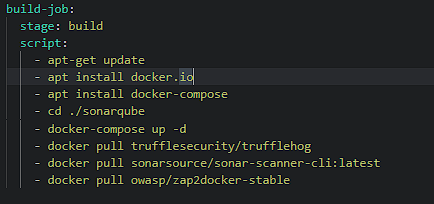

  

  
2. test - &#1101;&#1090;&#1086;&#1090; &#1101;&#1090;&#1072;&#1087; &#1087;&#1088;&#1077;&#1076;&#1085;&#1072;&#1079;&#1085;&#1072;&#1095;&#1077;&#1085; &#1076;&#1083;&#1103; &#1089;&#1082;&#1072;&#1085;&#1080;&#1088;&#1086;&#1074;&#1072;&#1085;&#1080;&#1103; &#1087;&#1088;&#1086;&#1077;&#1082;&#1090;&#1072; &#1072;&#1075;&#1077;&#1085;&#1090;&#1086;&#1084; sonarqube(SAST), &#1082;&#1086;&#1090;&#1086;&#1088;&#1099;&#1081; &#1086;&#1090;&#1087;&#1088;&#1072;&#1074;&#1083;&#1103;&#1077;&#1090; &#1074;&#1089;&#1077; &#1085;&#1072;&#1081;&#1076;&#1077;&#1085;&#1085;&#1099;&#1077; &#1091;&#1103;&#1079;&#1074;&#1080;&#1084;&#1086;&#1089;&#1090;&#1080; &#1080; &#1079;&#1072;&#1087;&#1072;&#1093;&#1080; &#1082;&#1086;&#1076;&#1072;

  
&#1074; &#1084;&#1077;&#1085;&#1077;&#1076;&#1078;&#1077;&#1088;, &#1082;&#1086;&#1090;&#1086;&#1088;&#1099;&#1081; &#1088;&#1072;&#1073;&#1086;&#1090;&#1072;&#1077;&#1090; &#1085;&#1072; 9000 &#1087;&#1086;&#1088;&#1090;&#1091;. &#1058;&#1072;&#1082;&#1078;&#1077; &#1085;&#1072; &#1101;&#1090;&#1086;&#1084; &#1101;&#1090;&#1072;&#1087;&#1077; &#1085;&#1072;&#1089;&#1090;&#1088;&#1086;&#1077;&#1085; &#1090;&#1088;&#1080;&#1075;&#1075;&#1077;&#1088;, &#1086;&#1085; &#1089;&#1088;&#1072;&#1073;&#1072;&#1090;&#1099;&#1074;&#1072;&#1077;&#1090; &#1085;&#1072; &#1089;&#1077;&#1088;&#1100;&#1077;&#1079;&#1085;&#1099;&#1077; &#1091;&#1103;&#1079;&#1074;&#1080;&#1084;&#1086;&#1089;&#1090;&#1080; &#1085;&#1072;&#1081;&#1076;&#1077;&#1085;&#1085;&#1099;&#1077; &#1074; &#1082;&#1086;&#1076;&#1077; &#1080; &#1087;&#1086;&#1083;&#1085;&#1086;&#1089;&#1090;&#1100;&#1102; &#1086;&#1089;&#1090;&#1072;&#1085;&#1072;&#1074;&#1083;&#1080;&#1074;&#1072;&#1077;&#1090; pipeline &#1076;&#1086; &#1090;&#1077;&#1093; &#1087;&#1086;&#1088; &#1087;&#1086;&#1082;&#1072; &#1091;&#1103;&#1079;&#1074;&#1080;&#1084;&#1086;&#1089;&#1090;&#1100; &#1085;&#1077; &#1073;&#1091;&#1076;&#1077;&#1090; &#1091;&#1089;&#1090;&#1088;&#1072;&#1085;&#1077;&#1085;&#1072; &#1080; &#1077;&#1075;&#1086; &#1085;&#1077; &#1079;&#1072;&#1087;&#1091;&#1089;&#1090;&#1103;&#1090; &#1074;&#1085;&#1086;&#1074;&#1100;.

  

  
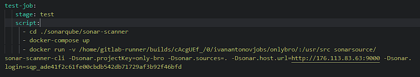

  

  
3. &nbsp;deploy - &#1077;&#1089;&#1083;&#1080; &#1089;&#1077;&#1088;&#1100;&#1077;&#1079;&#1085;&#1099;&#1093; &#1091;&#1103;&#1079;&#1074;&#1080;&#1084;&#1086;&#1089;&#1090;&#1077;&#1081; &#1085;&#1077; &#1073;&#1099;&#1083;&#1086; &#1085;&#1072;&#1081;&#1076;&#1077;&#1085;&#1086; &#1089;&#1090;&#1072;&#1090;&#1080;&#1095;&#1077;&#1089;&#1082;&#1080;&#1084; &#1072;&#1085;&#1072;&#1083;&#1080;&#1079;&#1072;&#1090;&#1086;&#1088;&#1086;&#1084;, &#1090;&#1086; &#1084;&#1099; &#1079;&#1072;&#1087;&#1091;&#1089;&#1082;&#1072;&#1077;&#1084; &#1088;&#1072;&#1079;&#1074;&#1086;&#1088;&#1072;&#1095;&#1080;&#1074;&#1072;&#1077;&#1084; &#1087;&#1088;&#1086;&#1077;&#1082;&#1090; &#1085;&#1072; &#1090;&#1077;&#1089;&#1090;&#1086;&#1074;&#1099;&#1081; (&#1074; &#1090;&#1077;&#1086;&#1088;&#1080;&#1080;) &#1089;&#1077;&#1088;&#1074;&#1077;&#1088;. &#1042; &#1084;&#1086;&#1077;&#1084; &#1089;&#1083;&#1091;&#1095;&#1072;&#1077; &#1082;&#1086;&#1076; &#1091;&#1078;&#1077; &#1073;&#1099;&#1083; &#1088;&#1072;&#1079;&#1084;&#1077;&#1097;&#1077;&#1085; &#1085;&#1072; &#1086;&#1089;&#1085;&#1086;&#1074;&#1085;&#1086;&#1084; &#1089;&#1077;&#1088;&#1074;&#1077;&#1088;&#1077;. &#1042;&#1077;&#1073;-&#1087;&#1088;&#1080;&#1083;&#1086;&#1078;&#1077;&#1085;&#1080;&#1077; &#1073;&#1091;&#1076;&#1077;&#1090; &#1088;&#1072;&#1073;&#1086;&#1090;&#1072;&#1090;&#1100; &#1085;&#1072; 8080 &#1087;&#1086;&#1088;&#1090;&#1091;, phpmyadmin &#1085;&#1072; 8765. &#1055;&#1088;&#1080;&#1083;&#1086;&#1078;&#1077;&#1085;&#1080;&#1077; &#1088;&#1072;&#1073;&#1086;&#1090;&#1072;&#1077;&#1090; &#1074; &#1089;&#1074;&#1103;&#1079;&#1082;&#1077; &#1082;&#1086;&#1085;&#1090;&#1077;&#1081;&#1085;&#1077;&#1088;&#1086;&#1074; (apache + php + mariadb + phpmyadmin).

  

  
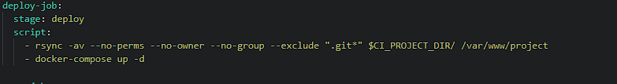

  

  
4. scan - &#1087;&#1088;&#1077;&#1076;&#1085;&#1072;&#1079;&#1085;&#1072;&#1095;&#1077;&#1085; &#1076;&#1083;&#1103; &#1076;&#1080;&#1085;&#1072;&#1084;&#1080;&#1095;&#1077;&#1089;&#1082;&#1086;&#1075;&#1086; &#1072;&#1085;&#1072;&#1083;&#1080;&#1079;&#1072;&#1090;&#1086;&#1088;&#1072; OWASP ZAP, &#1082;&#1086;&#1090;&#1086;&#1088;&#1099;&#1081; &#1079;&#1072;&#1087;&#1091;&#1089;&#1082;&#1072;&#1077;&#1090;&#1089;&#1103; &#1080;&#1079; &#1082;&#1086;&#1085;&#1090;&#1077;&#1081;&#1085;&#1077;&#1088;&#1072; &#1087;&#1086;&#1076; root. &#1056;&#1077;&#1087;&#1086;&#1088;&#1090; &#1086; &#1085;&#1072;&#1081;&#1076;&#1077;&#1085;&#1085;&#1099;&#1093; &#1091;&#1103;&#1079;&#1074;&#1080;&#1084;&#1086;&#1089;&#1090;&#1103;&#1093; &#1074;&#1099;&#1074;&#1086;&#1076;&#1080;&#1090;&#1089;&#1103; &#1087;&#1088;&#1103;&#1084;&#1080;&#1082;&#1086;&#1084; &#1085;&#1072; &#1101;&#1082;&#1088;&#1072;&#1085;, &#1075;&#1076;&#1077; &#1079;&#1072;&#1087;&#1091;&#1097;&#1077;&#1085; pipeline. &#1047;&#1076;&#1077;&#1089;&#1100; &#1090;&#1072;&#1082;&#1078;&#1077; &#1085;&#1072;&#1089;&#1090;&#1088;&#1086;&#1077;&#1085;&#1099; &#1090;&#1088;&#1080;&#1075;&#1075;&#1077;&#1088;&#1099; &#1085;&#1072; &#1086;&#1090;&#1084;&#1077;&#1085;&#1091; &#1088;&#1072;&#1079;&#1074;&#1077;&#1088;&#1090;&#1099;&#1074;&#1072;&#1085;&#1080;&#1103;, &#1077;&#1089;&#1083;&#1080; &#1073;&#1091;&#1076;&#1091;&#1090; &#1085;&#1072;&#1081;&#1076;&#1077;&#1085;&#1099; &#1082;&#1088;&#1080;&#1090;&#1080;&#1095;&#1077;&#1089;&#1082;&#1080;&#1077; &#1091;&#1103;&#1079;&#1074;&#1080;&#1084;&#1086;&#1089;&#1090;&#1080;.

  

  
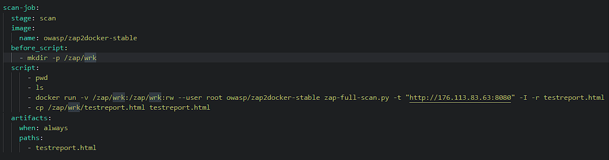

  

  

  

  

  
5. secrets - &nbsp;&#1085;&#1072;&#1087;&#1086;&#1089;&#1083;&#1077;&#1076;&#1086;&#1082; &#1079;&#1072;&#1087;&#1091;&#1089;&#1082;&#1072;&#1077;&#1090;&#1089;&#1103; &#1087;&#1086;&#1080;&#1089;&#1082; &#1089;&#1077;&#1082;&#1088;&#1077;&#1090;&#1086;&#1074; &#1074; &#1082;&#1086;&#1076;&#1077; &#1087;&#1088;&#1080; &#1087;&#1086;&#1084;&#1086;&#1097;&#1080; trufflehog. &#1054;&#1085; &#1090;&#1072;&#1082;&#1078;&#1077; &#1088;&#1072;&#1073;&#1086;&#1090;&#1072;&#1077;&#1090; &#1080;&#1079; docker &#1082;&#1086;&#1085;&#1090;&#1077;&#1081;&#1085;&#1077;&#1088;&#1072;. &#1054;&#1090;&#1095;&#1077;&#1090; &#1074;&#1099;&#1074;&#1086;&#1076;&#1080;&#1090;&#1089;&#1103; &#1087;&#1088;&#1103;&#1084;&#1086; &#1085;&#1072; &#1101;&#1082;&#1088;&#1072;&#1085;, &#1075;&#1076;&#1077; &#1079;&#1072;&#1087;&#1091;&#1097;&#1077;&#1085; pipeline.

  

  
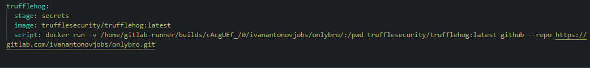

  

  
&#1056;&#1077;&#1079;&#1091;&#1083;&#1100;&#1090;&#1072;&#1090;: &#1079;&#1072;&#1087;&#1091;&#1097;&#1077;&#1085;&#1085;&#1072;&#1103; &#1089;&#1073;&#1086;&#1088;&#1082;&#1072;, &#1089;&#1082;&#1072;&#1085;&#1080;&#1088;&#1086;&#1074;&#1072;&#1085;&#1080;&#1077; &#1080; &#1076;&#1086;&#1089;&#1090;&#1072;&#1074;&#1082;&#1072; &#1087;&#1088;&#1086;&#1077;&#1082;&#1090;&#1072; &#1087;&#1088;&#1103;&#1084;&#1080;&#1082;&#1086;&#1084; &#1085;&#1072; &#1091;&#1076;&#1072;&#1083;&#1077;&#1085;&#1085;&#1099;&#1081; &#1089;&#1077;&#1088;&#1074;&#1077;&#1088;!

  

  
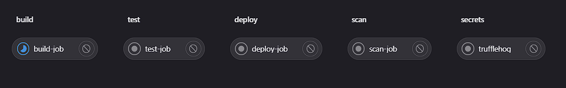

  

  
&#1069;&#1090;&#1072;&#1087; 2. SAST

  

  
&#1042; &#1101;&#1090;&#1086;&#1084; &#1073;&#1083;&#1086;&#1082;&#1077; &#1103; &#1087;&#1088;&#1086;&#1076;&#1077;&#1084;&#1086;&#1085;&#1089;&#1090;&#1088;&#1080;&#1088;&#1091;&#1102; &#1089;&#1074;&#1103;&#1079;&#1082;&#1091; &#1089;&#1074;&#1086;&#1077;&#1075;&#1086; &#1087;&#1088;&#1086;&#1077;&#1082;&#1090;&#1072; &#1089; sonarqube, &#1072; &#1090;&#1072;&#1082;&#1078;&#1077; &#1087;&#1086;&#1082;&#1072;&#1078;&#1091; &#1088;&#1077;&#1079;&#1091;&#1083;&#1100;&#1090;&#1072;&#1090;&#1099; &nbsp;&#1089;&#1082;&#1072;&#1085;&#1080;&#1088;&#1086;&#1074;&#1072;&#1085;&#1080;&#1103; &#1074; pipeline!

  

  
&#1044;&#1083;&#1103; &#1085;&#1072;&#1095;&#1072;&#1083;&#1072; &#1088;&#1072;&#1073;&#1086;&#1090;&#1099; sonar-scanner(agent) &#1085;&#1077;&#1086;&#1073;&#1093;&#1086;&#1076;&#1080;&#1084;&#1086; &#1079;&#1072;&#1087;&#1091;&#1089;&#1090;&#1080;&#1090;&#1100; sonarqube(server), &#1074; &#1085;&#1072;&#1089;&#1090;&#1088;&#1086;&#1081;&#1082;&#1072;&#1093; &#1087;&#1086;&#1083;&#1091;&#1095;&#1080;&#1090;&#1100; &#1089;&#1086;&#1086;&#1090;&#1074;&#1077;&#1090;&#1089;&#1090;&#1074;&#1091;&#1102;&#1097;&#1091;&#1102; &#1082;&#1086;&#1084;&#1072;&#1085;&#1076;&#1091;, &#1082;&#1086;&#1090;&#1086;&#1088;&#1091;&#1102; &#1072;&#1075;&#1077;&#1085;&#1090; &#1073;&#1091;&#1076;&#1077;&#1090; &#1080;&#1089;&#1087;&#1086;&#1083;&#1100;&#1079;&#1086;&#1074;&#1072;&#1090;&#1100; &#1074; &#1076;&#1072;&#1083;&#1100;&#1085;&#1077;&#1081;&#1096;&#1077;&#1084;.

  

  
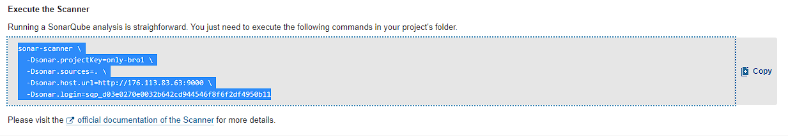

  
&#1042; &#1092;&#1072;&#1081;&#1083;&#1077; gitlab-ci.yml &#1084;&#1099; &#1076;&#1086;&#1073;&#1072;&#1074;&#1080;&#1083;&#1080; &#1089;&#1090;&#1088;&#1086;&#1082;&#1091; &#1074;&#1099;&#1096;&#1077; &#1080; &#1087;&#1088;&#1080; &#1079;&#1072;&#1087;&#1091;&#1089;&#1082;&#1077; &#1089;&#1073;&#1086;&#1088;&#1086;&#1095;&#1085;&#1086;&#1081; &#1083;&#1080;&#1085;&#1080;&#1080; &#1091; &#1085;&#1072;&#1089; &#1074; &#1083;&#1086;&#1075;&#1072;&#1093; &#1086;&#1090;&#1086;&#1073;&#1088;&#1072;&#1078;&#1072;&#1077;&#1090;&#1089;&#1103; &#1087;&#1088;&#1086;&#1094;&#1077;&#1089;&#1089; &#1090;&#1077;&#1089;&#1090;&#1080;&#1088;&#1086;&#1074;&#1072;&#1085;&#1080;&#1103;: 

  

  
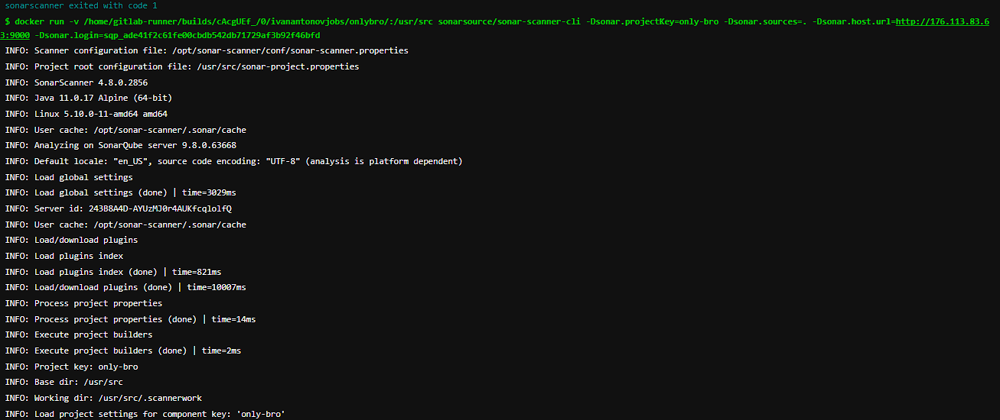

  

  
&#1055;&#1086;&#1089;&#1083;&#1077; &#1090;&#1077;&#1089;&#1090;&#1080;&#1088;&#1086;&#1074;&#1072;&#1085;&#1080;&#1103; &#1088;&#1077;&#1079;&#1091;&#1083;&#1100;&#1090;&#1072;&#1090;&#1099; &#1086;&#1090;&#1086;&#1073;&#1088;&#1072;&#1078;&#1072;&#1102;&#1090;&#1089;&#1103; &#1074; &#1084;&#1077;&#1085;&#1077;&#1076;&#1078;&#1077;&#1088;&#1077; sonarqube &#1089; &#1087;&#1086;&#1076;&#1088;&#1086;&#1073;&#1085;&#1099;&#1084; &#1086;&#1087;&#1080;&#1089;&#1072;&#1085;&#1080;&#1077;&#1084; &#1087;&#1088;&#1086;&#1073;&#1083;&#1077;&#1084;:

  

  
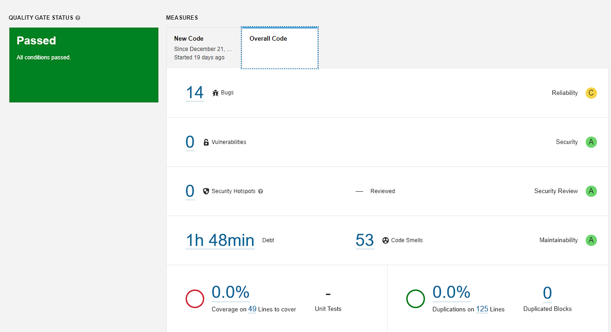

  

  
&#1042;&#1072;&#1078;&#1085;&#1086; &#1079;&#1072;&#1084;&#1077;&#1090;&#1080;&#1090;&#1100;, &#1095;&#1090;&#1086; &#1087;&#1088;&#1080; &#1103;&#1074;&#1085;&#1099;&#1093; &#1087;&#1088;&#1086;&#1073;&#1083;&#1077;&#1084;&#1072;&#1093; &#1080; &#1089;&#1077;&#1088;&#1100;&#1077;&#1079;&#1085;&#1099;&#1093; &#1085;&#1072;&#1088;&#1091;&#1096;&#1077;&#1085;&#1080;&#1103;&#1093; &#1073;&#1077;&#1079;&#1086;&#1087;&#1072;&#1089;&#1085;&#1086;&#1089;&#1090;&#1080; &#1089;&#1073;&#1086;&#1088;&#1082;&#1072; &#1087;&#1088;&#1086;&#1077;&#1082;&#1090;&#1072; &#1073;&#1091;&#1076;&#1077;&#1090; &#1086;&#1090;&#1084;&#1077;&#1085;&#1077;&#1085;&#1072; &#1090;&#1088;&#1080;&#1075;&#1075;&#1077;&#1088;&#1086;&#1084;, &#1085;&#1072;&#1089;&#1090;&#1088;&#1086;&#1077;&#1085;&#1085;&#1099;&#1084; &#1074;&#1085;&#1091;&#1090;&#1088;&#1080; &#1092;&#1072;&#1081;&#1083;&#1072; giltab-ci.yml.

  

  

  

  

  
&#1069;&#1090;&#1072;&#1087; 3. DAST

  

  
&#1055;&#1086;&#1089;&#1083;&#1077; &#1089;&#1082;&#1072;&#1085;&#1080;&#1088;&#1086;&#1074;&#1072;&#1085;&#1080;&#1103; &#1073;&#1077;&#1079;&#1086;&#1087;&#1072;&#1089;&#1085;&#1086;&#1089;&#1090;&#1080; &#1089;&#1090;&#1072;&#1090;&#1080;&#1095;&#1077;&#1089;&#1082;&#1080;&#1084; &#1072;&#1085;&#1072;&#1083;&#1080;&#1079;&#1072;&#1090;&#1086;&#1088;&#1086;&#1084;, &#1085;&#1077;&#1086;&#1073;&#1093;&#1086;&#1076;&#1080;&#1084;&#1086; &#1087;&#1088;&#1086;&#1074;&#1077;&#1088;&#1080;&#1090;&#1100; &#1086;&#1089;&#1085;&#1086;&#1074;&#1085;&#1099;&#1077; &#1091;&#1103;&#1079;&#1074;&#1080;&#1084;&#1086;&#1089;&#1090;&#1080; &#1087;&#1088;&#1080; &#1087;&#1086;&#1084;&#1086;&#1097;&#1080; OWASP ZAP - &#1076;&#1080;&#1085;&#1072;&#1084;&#1080;&#1095;&#1077;&#1089;&#1082;&#1080;&#1081; &#1072;&#1085;&#1072;&#1083;&#1080;&#1079;&#1072;&#1090;&#1086;&#1088; &#1082;&#1086;&#1076;.

  
&#1042; &#1101;&#1090;&#1086;&#1084; &#1087;&#1088;&#1086;&#1077;&#1082;&#1090;&#1077; &#1103; &#1080;&#1089;&#1087;&#1086;&#1083;&#1100;&#1079;&#1086;&#1074;&#1072;&#1083; &#1087;&#1086;&#1076;&#1075;&#1086;&#1090;&#1086;&#1074;&#1083;&#1077;&#1085;&#1085;&#1099;&#1081; &#1089;&#1082;&#1088;&#1080;&#1087;&#1090; &ldquo;full scan&rdquo;. 

  

  
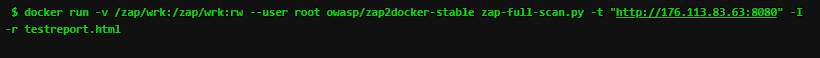

  
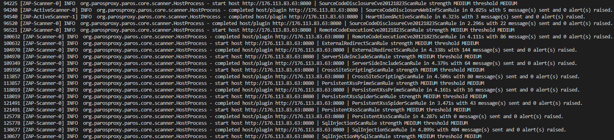

  

  
&#1055;&#1086;&#1089;&#1083;&#1077; &#1082;&#1086;&#1090;&#1086;&#1088;&#1086;&#1075;&#1086; &#1089;&#1086;&#1079;&#1076;&#1072;&#1077;&#1090;&#1089;&#1103; &#1092;&#1072;&#1081;&#1083; &#1089; &#1086;&#1090;&#1095;&#1077;&#1090;&#1086;&#1084;, &#1086;&#1085; &#1074;&#1082;&#1083;&#1102;&#1095;&#1072;&#1077;&#1090; &#1074; &#1089;&#1077;&#1073;&#1103; &#1074;&#1089;&#1077; &#1085;&#1072;&#1081;&#1076;&#1077;&#1085;&#1085;&#1099;&#1077; &#1091;&#1103;&#1079;&#1074;&#1080;&#1084;&#1086;&#1089;&#1090;&#1080; &#1080; &#1080;&#1085;&#1092;&#1086;&#1088;&#1084;&#1072;&#1094;&#1080;&#1103; &#1082;&#1086;&#1090;&#1086;&#1088;&#1072;&#1103; &#1084;&#1086;&#1078;&#1077;&#1090; &#1073;&#1099;&#1090;&#1100; &#1087;&#1086;&#1083;&#1077;&#1079;&#1085;&#1072; &#1089; &#1090;&#1086;&#1095;&#1082;&#1080; &#1079;&#1088;&#1077;&#1085;&#1080;&#1103; &#1073;&#1077;&#1079;&#1086;&#1087;&#1072;&#1089;&#1085;&#1086;&#1089;&#1090;&#1080; &#1080; &#1082;&#1072;&#1095;&#1077;&#1089;&#1090;&#1074;&#1072; &#1082;&#1086;&#1076;&#1072;.

  

  
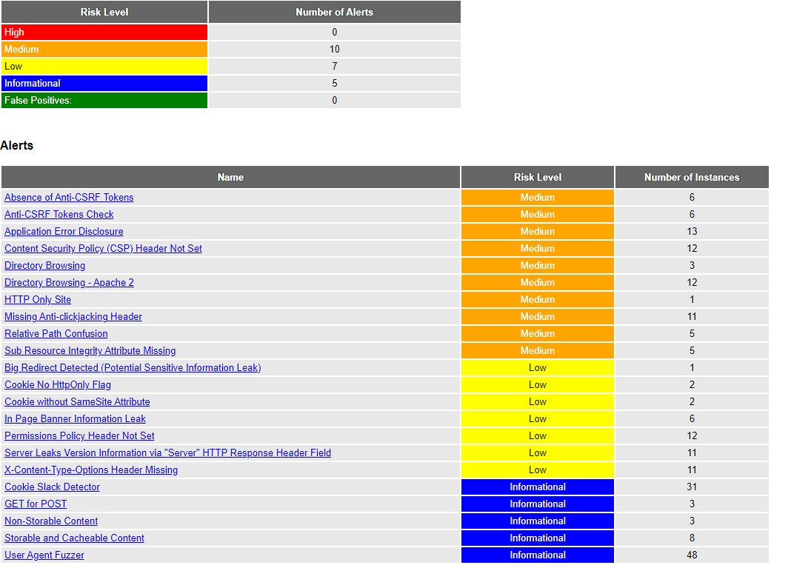

  

  

  
&#1069;&#1090;&#1072;&#1087; 4. Security Checks

  

  
&#1053;&#1072; &#1101;&#1090;&#1086;&#1084; &#1096;&#1072;&#1075;&#1077; &#1103; &#1080;&#1089;&#1087;&#1086;&#1083;&#1100;&#1079;&#1086;&#1074;&#1072;&#1083; docker-&#1082;&#1086;&#1085;&#1090;&#1077;&#1081;&#1085;&#1077;&#1088; c &#1091;&#1090;&#1080;&#1083;&#1080;&#1090;&#1086;&#1081; TruffleHog (&#1093;&#1088;&#1102;-&#1093;&#1088;&#1102;). &#1047;&#1072;&#1087;&#1091;&#1089;&#1082;&#1072;&#1077;&#1090;&#1089;&#1103; &#1074;&#1089;&#1077; &#1074; pipeline &#1086;&#1076;&#1085;&#1086;&#1081; &#1082;&#1086;&#1084;&#1072;&#1085;&#1076;&#1086;&#1081; &#1082; &#1082;&#1086;&#1085;&#1090;&#1077;&#1081;&#1085;&#1077;&#1088;&#1091;. &#1055;&#1086;&#1089;&#1083;&#1077; &#1095;&#1077;&#1075;&#1086; &#1087;&#1088;&#1103;&#1084;&#1086; &#1074; &#1083;&#1086;&#1075;&#1072;&#1093; &#1084;&#1086;&#1078;&#1085;&#1086; &#1085;&#1072;&#1073;&#1083;&#1102;&#1076;&#1072;&#1090;&#1100; &#1085;&#1072;&#1081;&#1076;&#1077;&#1085;&#1085;&#1099;&#1077; &#1088;&#1077;&#1079;&#1091;&#1083;&#1100;&#1090;&#1072;&#1090;&#1099;. &#1047;&#1076;&#1077;&#1089;&#1100; &#1090;&#1072;&#1082;&#1078;&#1077; &#1085;&#1072;&#1089;&#1090;&#1088;&#1086;&#1077;&#1085;&#1099; &#1090;&#1088;&#1080;&#1075;&#1075;&#1077;&#1088;&#1099; &#1085;&#1072; &#1086;&#1090;&#1082;&#1083;&#1102;&#1095;&#1077;&#1085;&#1080;&#1077; &#1089;&#1073;&#1086;&#1088;&#1082;&#1080;, &#1077;&#1089;&#1083;&#1080; &#1073;&#1091;&#1076;&#1091;&#1090; &#1085;&#1072;&#1081;&#1076;&#1077;&#1085;&#1099; &#1082;&#1088;&#1080;&#1090;&#1080;&#1095;&#1077;&#1089;&#1082;&#1080;&#1077; &#1089;&#1077;&#1082;&#1088;&#1077;&#1090;&#1099;. &#1042;&#1099;&#1074;&#1086;&#1076; &#1087;&#1088;&#1086;&#1075;&#1088;&#1072;&#1084;&#1084;&#1099; &#1084;&#1086;&#1078;&#1085;&#1086; &#1091;&#1074;&#1080;&#1076;&#1077;&#1090;&#1100; &#1085;&#1072; &#1101;&#1090;&#1086;&#1084; &#1089;&#1082;&#1088;&#1080;&#1085;&#1096;&#1086;&#1090;&#1077;:

  

  
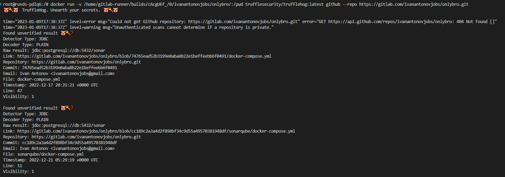

  

  
&#1069;&#1090;&#1072;&#1087; 4. Security Gateway

  

  
&#1044;&#1072;&#1085;&#1085;&#1099;&#1081; &#1101;&#1090;&#1072;&#1087; &#1088;&#1072;&#1089;&#1087;&#1080;&#1089;&#1072;&#1085; &#1074; SAST &#1080; DAST.

  

  
&#1048;&#1090;&#1086;&#1075;: &#1088;&#1077;&#1079;&#1091;&#1083;&#1100;&#1090;&#1072;&#1090;&#1086;&#1084; &#1088;&#1072;&#1073;&#1086;&#1090;&#1099; &#1089;&#1090;&#1072;&#1083; &#1087;&#1086;&#1083;&#1085;&#1086;&#1094;&#1077;&#1085;&#1085;&#1099;&#1081; &#1089;&#1072;&#1081;&#1090; &#1089; &#1074;&#1096;&#1080;&#1090;&#1086;&#1081; &#1087;&#1088;&#1086;&#1074;&#1077;&#1088;&#1082;&#1086;&#1081; &#1073;&#1077;&#1079;&#1086;&#1087;&#1072;&#1089;&#1085;&#1086;&#1089;&#1090;&#1080;, &#1082;&#1072;&#1095;&#1077;&#1089;&#1090;&#1074;&#1072; &#1082;&#1086;&#1076;&#1072; &#1080; &#1089;&#1077;&#1082;&#1088;&#1077;&#1090;&#1086;&#1074;. &#1040; &#1090;&#1072;&#1082;&#1078;&#1077; &#1088;&#1077;&#1072;&#1083;&#1080;&#1079;&#1086;&#1074;&#1072;&#1085;&#1072; &#1092;&#1080;&#1083;&#1086;&#1089;&#1086;&#1092;&#1080;&#1103; &#1080; &#1084;&#1077;&#1090;&#1086;&#1076;&#1086;&#1083;&#1086;&#1075;&#1080;&#1080; DevSecOps.

</body>

</html>
